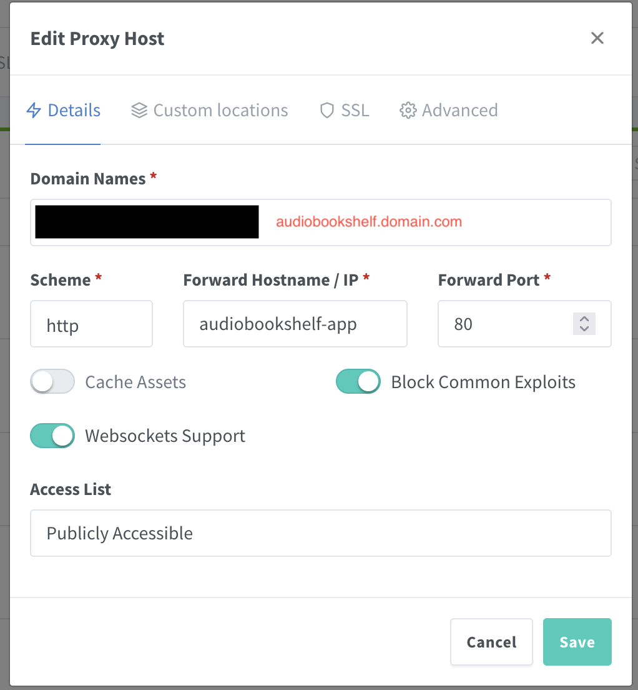
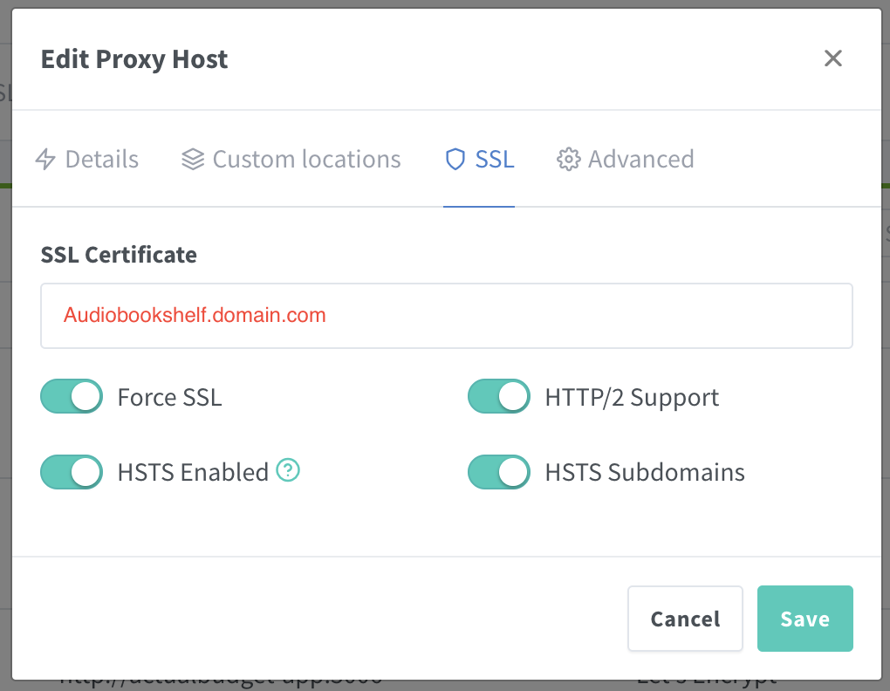

# Guide info

- Author: [@fogolin](https://github.com/fogolin)
- Date: 2024-03-04
- Last revision: 2024-03-04


---

## About this guide

This guide is destined for users installing the AudioBookShelf server on a Docker container and placing it under Nginx Proxy Manager routing. I've looked for it in forums and issues, but coudn't find much that helped me figure this out, so I've chatted with [Quan Nguyen](https://github.com/ravencore17) because of his [blog post](https://quannguyen.ca/setting-up-audiobookshelf/) on the subject and got it to work.

## Requirements

A Docker installation that runs both Nginx Proxy Manager and AudioBookShelf.

## Nginx Proxy Manager

Firs, let's set up the Nginx Proxy Manager network that's going to be used to route the AudioBookShelf server to an external domain. In my case, I'm using the following compose.yml file:

```compose
version: '3.8'
services:
  app:
    image: 'jc21/nginx-proxy-manager:latest'
    restart: unless-stopped
    ports:
      - '80:80'
      - '81:81'
      - '443:443'
    volumes:
      - ./data:/data
      - ./letsencrypt:/etc/letsencrypt
```

This is going to create a stack with the container itself, as well as a bridge network called `nginx_default`. This network is going to make the communication between Nginx and other containers possible.

If you need a guide setting up Nginx Proxy Manager, I suggest you consult their [documentation here](https://nginxproxymanager.com/guide/). The guides are pretty comprehensive and will get you through all necessary steps to set it up, configure SSL and domains. These are necessary for the next step, setting up the AudioBookShelf container on a domain.

## AudioBookShelf

To set up AudioBookShelf, I'm also using a compose.yml file, as follows:

```compose
version: "3.7"
services:
  audiobookshelf:
    container_name: audiobookshelf-app
    image: ghcr.io/advplyr/audiobookshelf:latest
    #ports:
    #  - 13378:80
    volumes:
      - /mnt/audiobookshelf/data/audiobooks:/audiobooks
      - /mnt/audiobookshelf/data/podcasts:/podcasts
      - /mnt/audiobookshelf/data/config:/config
      - /mnt/audiobookshelf/data/metadata:/metadata
    networks:
      - nginx
    restart: unless-stopped

networks:
  nginx:
    name: nginx_default
    external: true
```

This is just a regular docker compose file as you can find in [AudioBookShelf's documentation](https://www.audiobookshelf.org/docs#docker-compose-install), but instead of setting a port, we're going to leave it empty with the default port 80 (Nginx can deal with multiple containers running on port 80), and we'll add the `nginx_default` network we've created earlier, thus the container won't try to make a new network just for this container called `audiobookshelf_defaul` and will instead join this already existing one.

Obs.: make sure the folders on the volume section are correct for your installation and you can `docker compose up -d` these instructions.

## Setting up the Proxy Host

On Nginx Proxy Manager, go to `Hosts / Proxy Hosts` and click `Add Proxy Host`. Then, on the **Details** tab:

1. **Domain Names**: usually we go with a subdomain, such as **audiobookshelf**.example.com (make sure to replace example.com with your actual domain), but if that's your only installation, you can make it a top level, with no subdomain whatsoever, it's up to your use case and what you want to do.
2. **Scheme**: http
3. **Forward Hostname / IP**: `audiobookshelf-app` (this is the same as the container_name property on our compose file, so if you've changed it there, make sure to use the same name here)
4. **Forward Port**: `80`
5. **Enable settings**: make sure to enable `Websockets Support` and `Block Commom Exploits`
6. **Access List**: Publicly Accessible

It should look something like this:



After that, go to the **SSL** tab and:

1. **SSL Certificate**: select your desiredSSL certificate for the domain you're using
2. **Enable settings**: mark as selected all four options (`Force SSL`, `HTTP/2 Supoprt`, `HSTS Enabled` and `HSTS Subdomains`)

It should look something like this:



Now click **Save** and you're done, you already should be able to access your AudioBookShelf web client using the domain name you've set up.